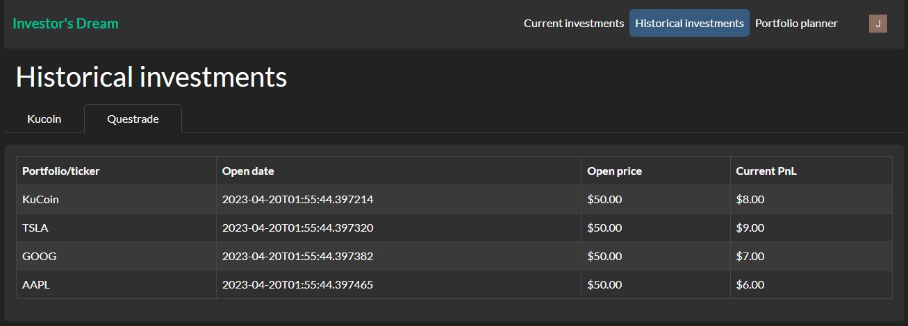
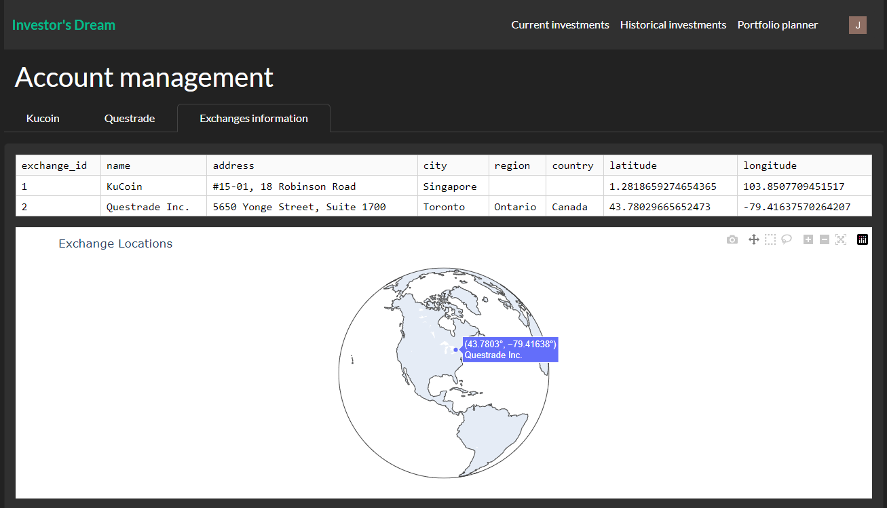
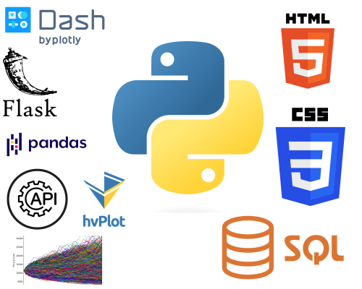

# Investor's Dream
Dash web-application for managing personal investments, as well as planning and simulating theoretical portfolios.

## Project description/outline
The Investor's Dream application is a tool that allows users to track historic and current investments while also planning potential future investments. Historic and current investments are downloaded from an exchange's server via the exchange's API and displayed in the application. Users can draft and analyze theoretcial portfolios utilizing a variety of graphical and tabular methods. Drafted portfolios can be saved to the application's PostgreSQL database. Simulations can be performed on theoretical portfolios and analyzed in tabular and/or graphical formats.

## Application usage
### Getting started
  
Users begin by navigating to the following web address:
[http://fintech1.richedev.com](http://fintech1.richedev.com)
The home page of the application provides users a login link in the top-right corner. Users are required to log in.

### Logging in
  
The application utilizes a social login service provided by [Auth0](https://auth0.com/). Users are requested to log in using one of the social methods provided.

### Current investments
  
Upon logging-in, users are brought to the *Current investments* screen where, if applicable, their current investments are displayed. A tabbed view allows users to view their current investments across multiple exchanges.

### Historical investments
  
The *Historical investments* screen displays users' historical investment data, if applicable. A tabbed view allows users to view their historical investments across multiple exchanges.

### Portfolio planner

The *Portfolio planner* screen provides users with a tool to draft and analyze new portfolios. Drafted portfolios must contain a name, an investment period, at least one ticker, and a total ticker weight equaling 1 across all tickers before it can be saved to the applications database.
  
  
  
  
  
Upon drafting a portfolio, users can run calculations to analyze historical portfolio performance and related statistics, including:
- Sharpe ratio
- Beta
- Daily returns
- Cumulative returns
- Daily closing price
  
  
  
  
By including an investment amount with a drafted portfolio, users can also run simulations to analyze theoretical future performance of the portfolio with statistics such as:
- Mean
- Standard deviation
- Quartiles
- 95% CI lower
- 95% CI upper
- Cumulative return trajectories
- Distribution of final cumulative returns

### Account management
  
The account management screen allows users to view their connected exchanges, along with information relating to the exchanges.

### Account management
  
For the privacy of personal information, users are encouraged to log out when not using the application.

## Tools used
  
- Python
  - APIs
    - Alpaca
    - Auth0
    - KuCoin
  - Dash
  - Flask
  - Holoviews
  - Monte Carlo simulator
  - Numpy
  - Pandas
  - Plotly
  - SQLAlchemy
  - YFinance
- SQL
  - PostgreSQL
- CSS
- HTML

## Questions to answer
1. How can an investor compare multiple simulated portfolios to determine their ideal investment portfolio?
2. How can an investor make the most money with the laest amount of risk?
3. Which asset mix can provide the strongest portfolio given current market conditions?
4. In what ways can an investor visualize their investment planning data?
5. Who could use this application?  

To answer the questions above, please refer to our [PowerPoint presentation](miscellaneous/Investor's Dream Project 1.pptx).

## Developers
- [Andrea Delgadillo Tomasevich](https://github.com/visionaryspirit)
- [Dmitry Chalganov](https://github.com/Imbadimasa)
- [John Yin](https://github.com/Ziqiangyin)
- [Julian Ritchey](https://github.com/julianritchey)